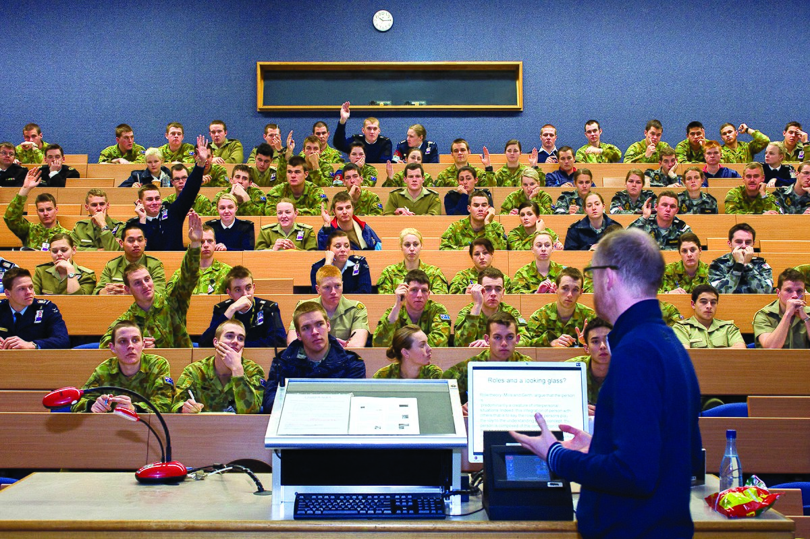

# dlib MMOD CNN face detection

https://pyimagesearch.com/2021/04/19/face-detection-with-dlib-hog-and-cnn/

Git pull this repo, cd to `room_count`.

Install system pre-reqs:
```
sudo apt install build-essential
sudo apt install cmake
sudo apt install libopenblas-dev
sudo apt install liblapack-dev
sudo apt install libx11-dev
sudo apt install libgtk3-dev
sudo apt install libgtk-3-dev
sudo apt install python-dev
sudo apt install python3-dev
```

Maybe you need to install venv for your current Python version:
```
python --version
sudo apt install python3.9-venv
```

Create Python virtual env:
```
python -m venv venv
source venv/bin/activate
python -m pip install --upgrade pip
python -m pip install wheel
python -m pip install -r requirements.txt
```

## Test run
```
cd dlib_mmod_cnn/
python cnn_face_detection.py --image ../images/ADFA_Lecture_Theatres.jpg
[INFO] loading CNN face detector using mmod_human_face_detector.dat...
[INFO[ performing face detection with dlib...
[INFO] face detection found 73 faces and took 18.4933 seconds
```

## ADFA Lecture Theatre

Model `mmod_human_face_detector.dat` using `imutils.resize(image, width=2000)`:

### Source image


### After detect run, 18 seconds on non-GPU PC


