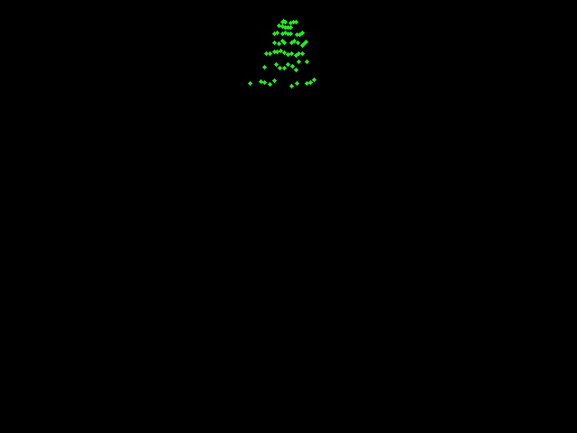
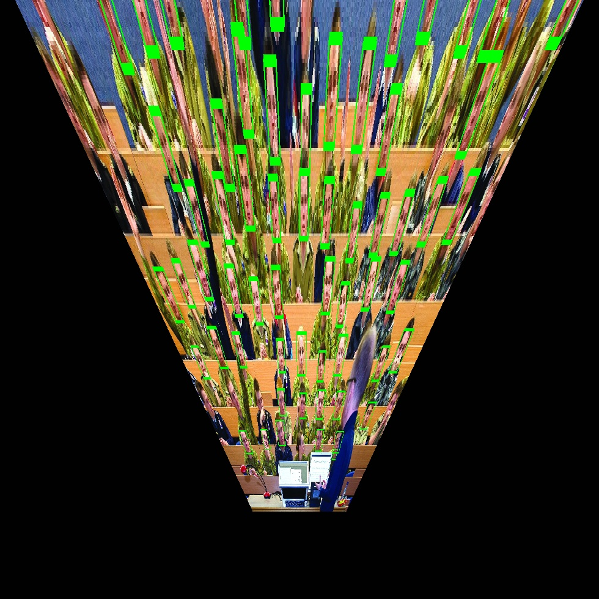

# Room face count using OpenCV haarcascade

https://hawksey.info/blog/2017/11/using-opencv-raspberry-pi-and-google-analytics-to-measure-audience-levels-via-face-detection/

https://rpihome.blogspot.com/2015/03/face-detection-with-raspberry-pi.html

https://pyimagesearch.com/category/faces/

https://pyimagesearch.com/2021/04/19/face-detection-with-dlib-hog-and-cnn/

## Requirements

Install the `cameratransform` and `opencv-contrib-python[-headless]` packages.

## Test run
```
cd haarcascade/
python haar_face_detection.py --image ../images/ADFA_Lecture_Theatres.jpg
```

## With 3-D projection & generating a topdown view
```
python3 haar_face_detection.py --3d \
	--sensor-width-mm 6.7 --sensor-height-mm 5.6 --focallength-mm 7.0 \
	--pos-x-m 0 --pos-y-m 0 --elevation-m 1.8 \
	--tilt-deg 76 --heading-deg 0 --roll-deg 0  --image ADFA_Lecture_Theatres.jpg $@
```

The numbers come from camera specification and a guess about the position of the viewer, with orientation parameters selected such that the 'ground plane' matches approximately with the lecture theatre seats. See [cameratransform](https://cameratransform.readthedocs.io/en/latest/) docs.

### Source image


### After detect run


### Topdown view

Green dots correspond to faces, viewed from overhead, with the lecturer position being top-centre facing down.



### Camera 'top' view projection

This is a stretching of the image to show an overhead view such that each pixel in the original image has been projected onto its approximate 'ground' location. It helps to show where the system thinks each pixel in the original image 'came from'.



